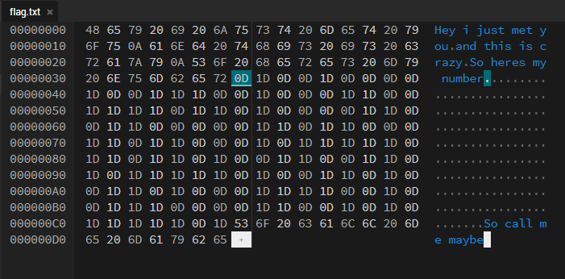

# Invisible Flag

Author: Cyrus

Date Created/Modified: 12/6/2022

Flag: HNF{C0ll_m3_M4y8e}

## Description
Find my number

## Hints
1. YourFirstHintHere
1. YourSecondHintHere (IF ANY)

## Distribution
These are the files that will be sent to the participants
- YourFileNameHere
    - SHA1: `0af039a0a8f24f6211ed6d42a3bd39bf148e7c80`

## Solution
Open file in hex editor 

Convert all 0D to 0 and 1D to 1

Obtain binary values
010010000100111001000110011110110100001100110000011011000110110001011111011011010011001101011111010011010011010001111001001110000110010101111101

Get Flag