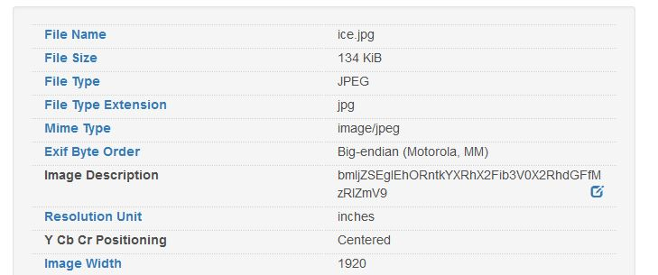
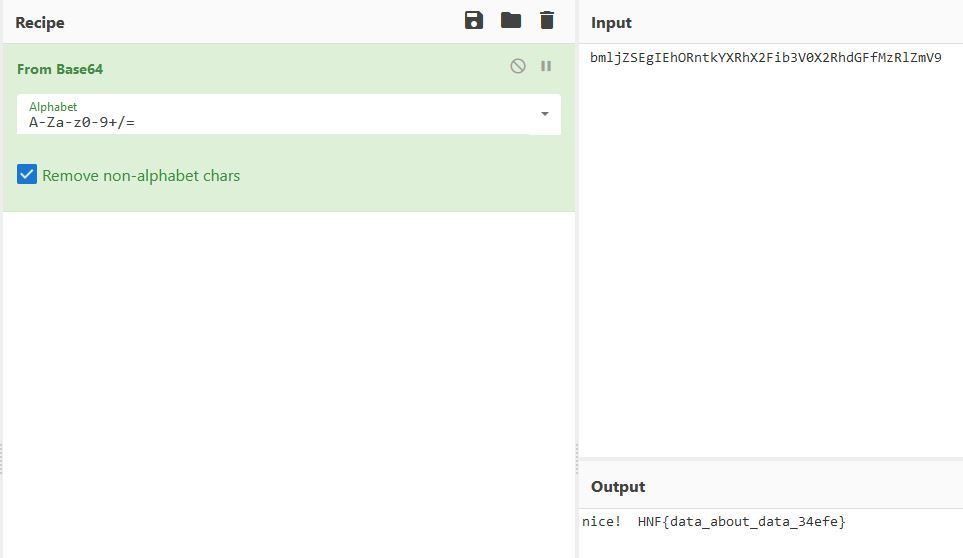

# Meta

Author: Eugenio

Date Created/Modified: 30/05/2022

Flag: HNF{data_about_data_34efe}

## Description
I wonder what this means

## Hints
1. Is there more data that is hidden?

## Distribution
These are the files that will be sent to the participants
- ice.jpg
    - SHA1: `1da87ece99693d60fbe1727489ada657d9fbb550`

## Solution
1. Send the file to a metadata viewer (or run exiftool)

1. There is some data in the description

1. Decode this from Base64
